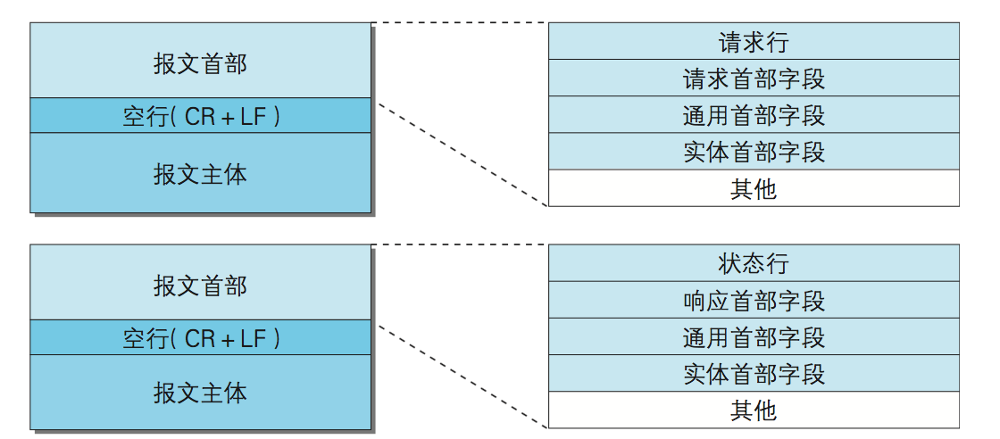

# Web 服务基于 HTTP 协议通信
注意：HTTP 通常被译为超文本传输协议，但这种译法并不严谨。严谨的译名应该 为“超文本转移协议”。但是前一译法已约定俗成。

## 1. 使用 HTTP 协议访问 web 服务
浏览 http://index.html Web 页面，在浏览器地址栏内输入 URL 之后，信息会被送往 Web 服务器，然后从服务器获得回复，回复内容就会显示在 Web 页面上。
1. 客户端通过dns协议，在获取了服务器的真实 ip 地址后，HTTP 协议就生成针对目标 Web 服务器的 HTTP 请求报文
2. 客户端的 TCP 协议为了方便通信，将 HTTP 请求报文分割成报文段（按序号），把报文段可靠地传给对方
3. IP 协议负责搜索对方的 ip 地址，一边中转一边传送到服务器
4. 到了服务端，TCP 协议再把从客户端那里接收到的报文段重组（按序号以原来的顺序）
5. 服务器负责解析请求并计算响应内容。
6. HTTP 协议继续对响应的内容进行处理，生成 HTTP 响应报文给客户端
……

整个过程依靠的是著名的 TCP/IP 协议栈，一般情况，总是客户端主动联系HTTP服务端。即，服务器不负责连接客户端，或创建一个到客户端的回调。（参见：HTTP协议规范）

## 2. 请求报文格式
HTTP 报文本身是由多行(用 CR+LF 作换行符，CR=Carriage Return，回车符:16进制 0x0d 和 LF=Line Feed，换行符:16进制 0x0a)数据构成的字符串文本，大致可分为报文首部和报文主体两块。通常，并不一定要有报文主体。

### 2.1. 一个HTTP请求包括三个组成部分
    *  方法—统一资源标识符(URI)—协议/版本
    *  请求的头部
    *  主体内容

POST /dashuai.html HTTP/1.1

Accept: text/plain;text/html

Accept-Language: en-gb

Connection: Keep-Alive

Host: localhost

User-Agent: Mozilla/4.0 (compatible; MSIE 4.01; Windows 98)

Content-Length: 33

Content-Type: application/x-www-form-urlencoded

Accept-Encoding: gzip, deflate

### 2.2. HTTP 1.1 支持7种类型的请求

GET, POST, HEAD, OPTIONS, PUT, DELETE和TRACE。

### 2.3. 具体说明
URI完全指明了一个互联网资源。URI通常是相对服务器的根目录解释的。因此，始终一斜线/开头

统一资源定位器(URL)其实是一种URI

请求的头部包含了关于客户端环境和请求的主体内容的有用信息。可能包括浏览器设置的语言，主体内容的长度等等。每个头部通过一个回车换行符(CRLF)来分隔。CRLF告诉HTTP服务器主体内容是在什么地方开始。在一些互联网编程书籍中，CRLF还被认为是HTTP请求的第四部分。

## 3. 响应报文格式
### 3.1. 一个HTTP响应也包括三个组成部分
    *  方法—统一资源标识符(URI)—协议/版本
    *  响应的头部
    *  主体内容

HTTP/1.1 200 OK

Server: Microsoft-IIS/4.0

Date: Mon, 5 Jan 2017 13:13:33 GMT

Content-Type: text/html

Last-Modified: Mon, 5 Jan 2017 13:13:12 GMT

Content-Length: 112

<html>

<head> <title>HTTP Response Example</title> </head>

<body> Welcome to Brainy Software </body>

</html>

响应头部的第一行类似于请求头部的第一行。 响应头部和请求头部类似，也包括很多有用的信息。响应的主体内容是响应本身的HTML内容。头部和主体内容通过CRLF分隔
